# 個人資訊 
0524046 鄭鴻翊
# Class:
2018-nkust-oo   
系統分析與設計
# Project:
人工智慧面試系統   Artificial Intelligence Interview System
# Members:
第20組

指導老師： 朱彥銘 教授

0524020<a href="https://github.com/0524020"> 洪湘嬅<a>

Email：0524020@nkust.edu.tw

0524046<a href="https://github.com/honyi1013"> 鄭鴻翊</a> 

Email：0524046@nkust.edu.tw

0524050<a href="https://github.com/Awen0524050"> 王亭文</a>

Email：0524050@nkust.edu.tw

# Introduction
近幾年，經常在新聞上談論到，大學畢業後求職不易的議題，社會新鮮人面對企業徵才已是非常普遍的社會議題了。在求職這件事情上，勞方與資方都必須付出相對的成本，對勞方(如勞方因與資方行政單位距離遙遠必須舟車勞頓)和資方(舉辦面試的人事成本)來說都是一件非常不便且花費時間的事情。而這只是套用在資方與勞方都位於台灣的情況下而已，如果今天企業徵才的範圍，距離不再是一天內汽機車交通工具能到達的程度，甚至是涉及跨國徵才的需求，那麼雙方所必需付出的成本將會隨著距離等比例成長。例如，今天有一間位於台北的公司，將派出五位主管前往菲律賓，進行勞工的面試以及篩選，那麼這五位主管都必須放下當下的工作，進行為期一周面對數百人、數千人的徵才過程；另一方面，參加面試的勞工，也都是來自菲律賓不同地區的居民，他們花費一周的時間，為了得到一份必須前往異地的工作，只為補足自己與家庭經濟需求。綜合兩方整體必須付出的成本，徵才都是一件所費不貲的事情。

因此本團隊預計於終端裝置設計一款由網頁實現所有面試流程的系統，具有設計題目、參與面試，以及利用輸出具有幫助決策之資訊，來進行挑選人才之「人工智慧面試系統」(Artificial Intelligence Interview System,AIIS)。徵才者於UI端進行註冊並新增面試，並根據該場面試設計題目，而求職者於網頁根據面試序號，進入該面試並進行問題的應答，並將影音上傳至位於伺服器的AI單元進行分析，於面試結束後的任何時間，徵才者可透過面試序號取得該場面試所有的面試參與人，進行觀看AI單元分析後的資訊以及應答影片，並進行評分的動作。

# 專題目標
### 系統簡介
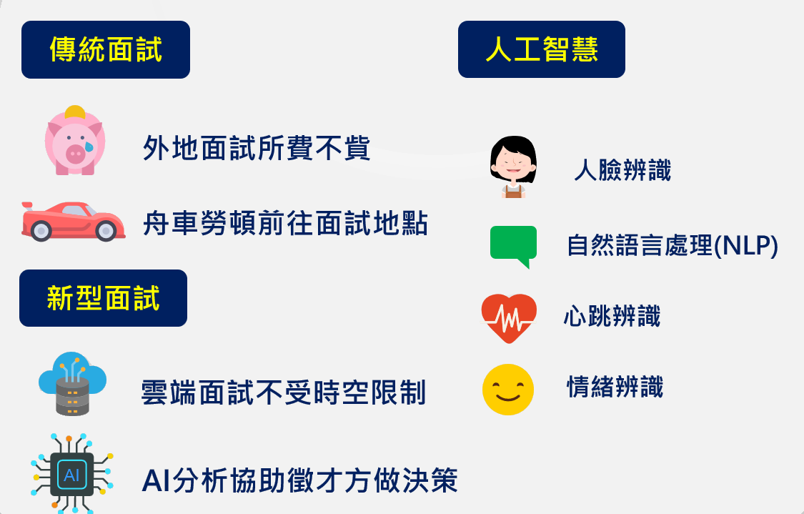
### 系統架構圖
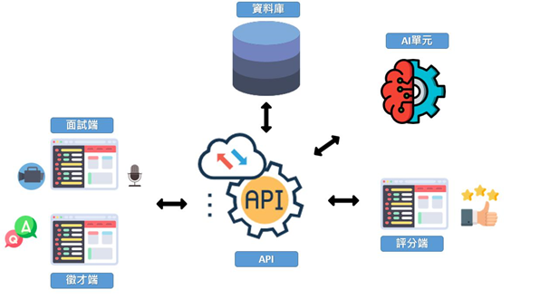
# 利害關係人
 關係人       | 需求
--------------|:---------------
公司人事部門   |  1.減少徵才的人事成本    2.節省舉辦面試的時間    3.能夠獲得公司需要的人才    4.快速獲得人才 
尋找工作的人   |  1.節省舟車勞頓的花費    2.節省面試時間    3.能夠得到分析後的回饋，改善自己，增加就業機會
面試主管單位   |  1.能夠節省面試時間(出題以及觀看)      2.能夠隨時隨地篩選求職者    3.能夠重點化瞭解求職者    4.能夠簡便的評分
     
# 事件圖

事件    | 使用案例
--------|:---------------------
1.減少徵才人事成本 2.節省舉辦面試時間 3.能夠獲得公司需要的人才 4.快速獲得人才 5.節省舟車勞頓的花費 6.節省面試時間 7.能夠得到分析後的回饋改善自己，增加就業機會 8.能夠節省面試(出題及觀看)時間 9.能夠隨時隨地篩選求職者 10.能夠重點化了解求職者 11.能夠簡便的評分|1.註冊公司資料 2.建立面試與面試內容 3.面試通知作業 4.建立個人資料 5.進行面試流程 6.人工智慧分析 7.觀看面試影片並評分 8.結果通知

# 使用案例圖

### 使用案例圖與參與者

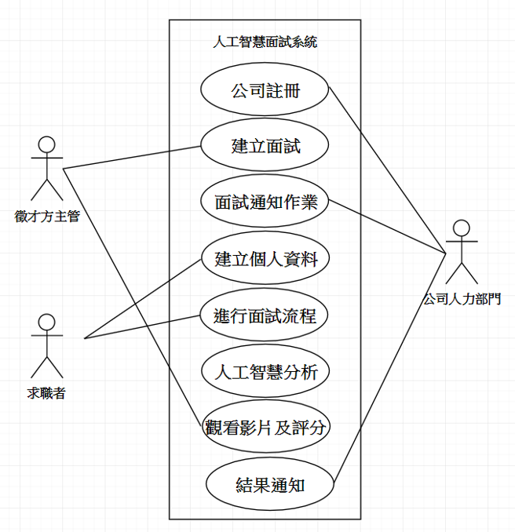

# 使用案例說明

### 觀看影片並評分使用案例說明

# 系統活動圖
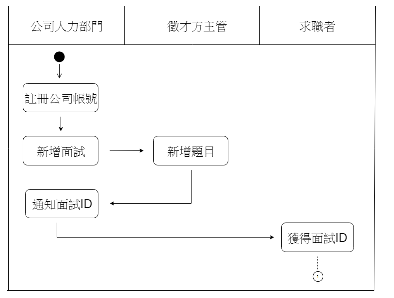
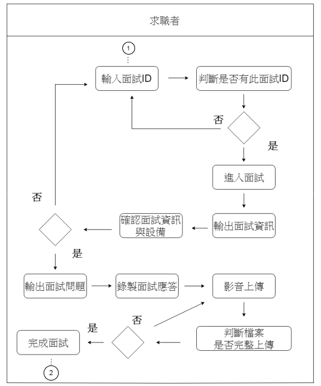
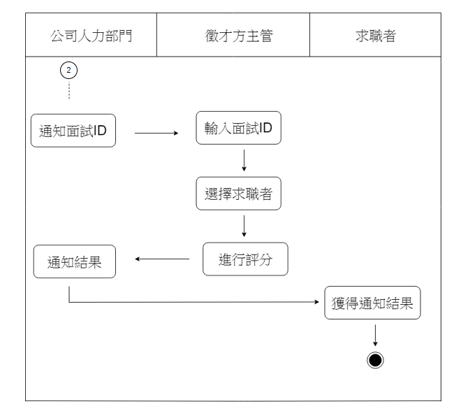

# 類別圖
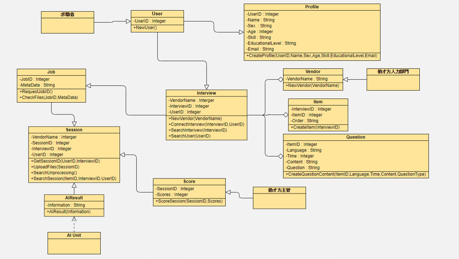

# 系統循序圖
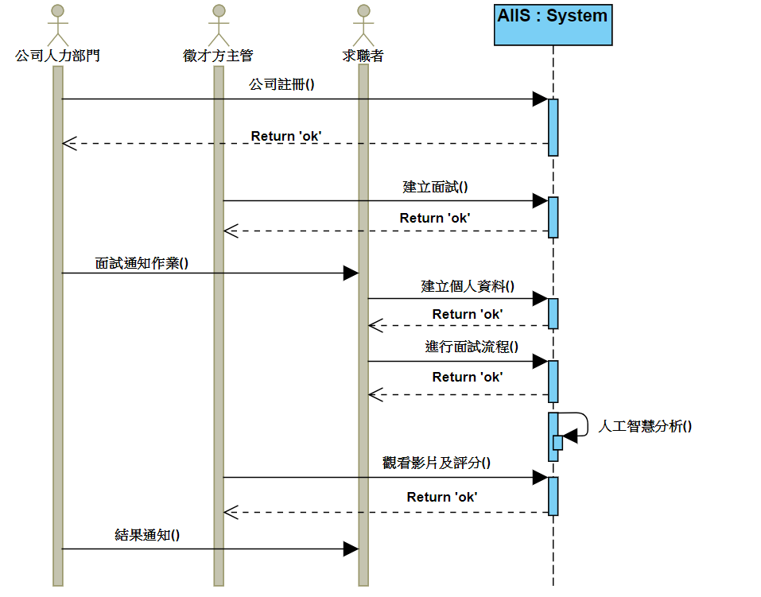

# 循序圖

### 公司註冊
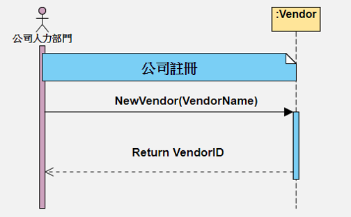

### 建立面試
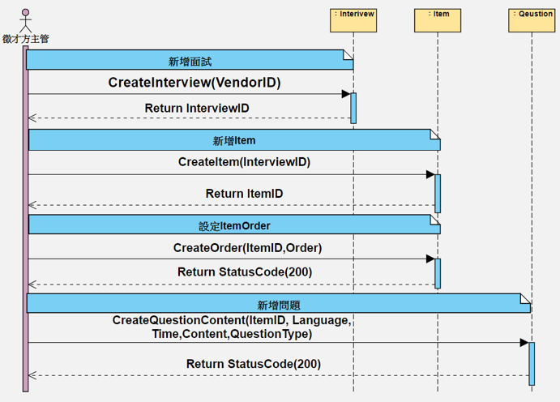

### 求職者建立個人資料

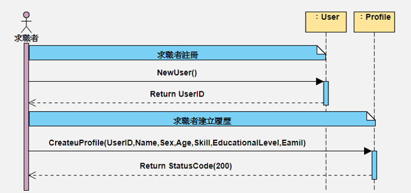

### 進行面試流程

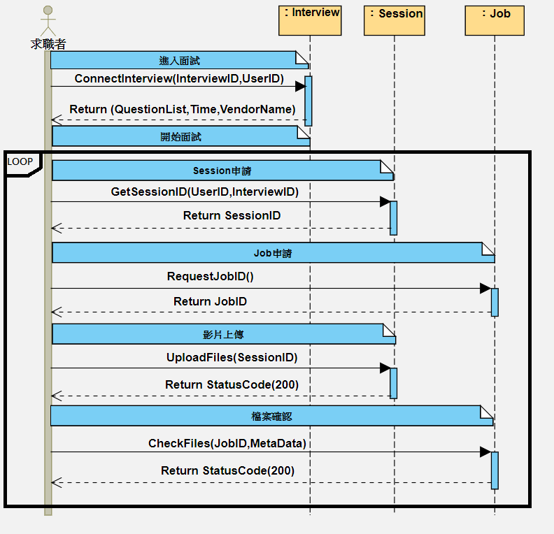

### 人工智慧分析

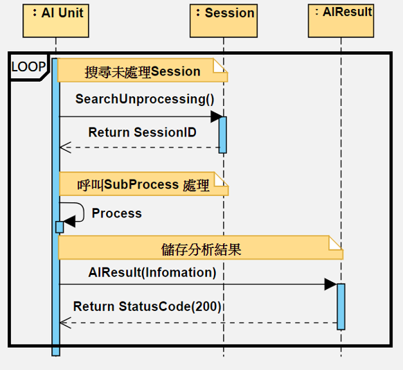

### 觀看影片及評分

# 測試計劃

